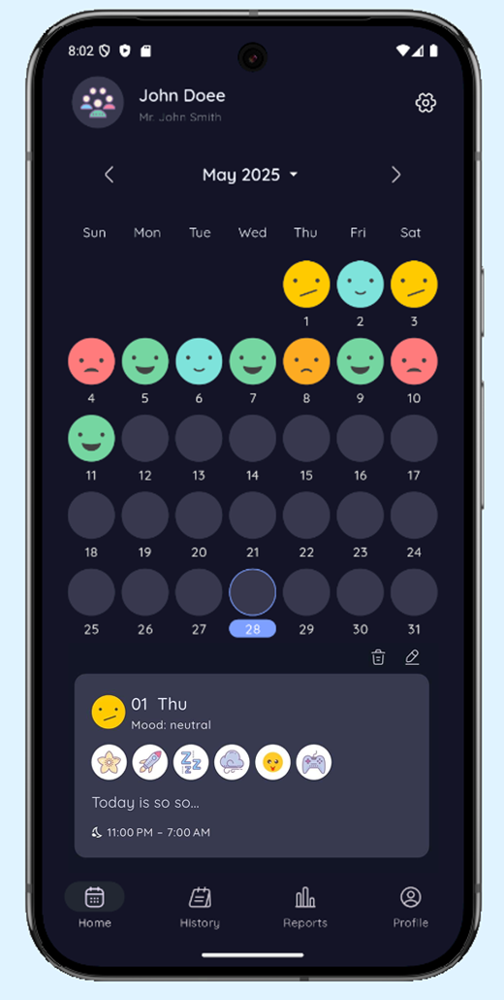
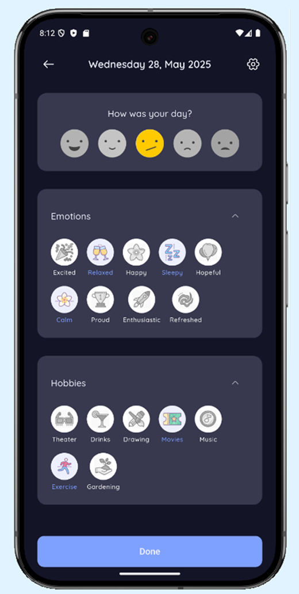

<!-- README for Moodiary -->

# 📝 Moodiary

Personal Mood Tracker App — Built with Flutter & Firebase

---

## 📱 About

**Moodiary** is a minimalist daily mood tracking application inspired by popular apps like Daylio and DailyBean. It helps users visualize emotional patterns through calendar logs, charts, and reports, offering insights into mental well-being over time.

This project was developed as part of my university coursework at King Mongkut's University of Technology Thonburi (KMUTT), following Agile methodologies.

---

## ✨ Key Features

- 📅 **Mood Calendar** — Log daily moods with icons and custom notes.
- 📊 **Mood Flow Reports** — Visualize trends monthly and yearly via charts.
- 📈 **Statistics & Analytics** — Frequent moods, best/worst days, icons breakdown.
- 🎨 **Custom Recording Blocks** — Personalize activities (sleep, work, exercise).
- 🔔 **Reminders & Notifications** — Encourage consistent journaling.
- ☁️ **Firebase Integration** — Realtime cloud sync, authentication, and Firestore storage.

---

## 🛠️ Tech Stack

| Technology | Usage                      |
| ---------- | -------------------------- |
| Flutter    | Frontend UI                |
| Firebase   | Backend (Auth, Firestore)  |
| GetX       | State Management & Routing |
| FL Chart   | Data Visualization         |
| Hive       | Local Storage (optional)   |

---

## 📂 Project Structure (Simplified)

```
lib/
├── features/
│   └── moodiary/
│       ├── controllers/
│       ├── data/
│       ├── models/
│       ├── screens/
│       └── widgets/
├── common/
├── utils/
├── main.dart
└── firebase_options.dart
```

---

## 🚀 Getting Started

### Prerequisites

- Flutter SDK (stable)
- Dart SDK
- Firebase project with Firestore & Auth enabled

### Installation

```bash
git clone https://github.com/TheCringeLord/Moodiary.git
cd Moodiary
flutter pub get
flutterfire configure
flutter run
```

---

## 🔑 Environment Setup

Configure Firebase in `firebase_options.dart` or via environment variables:

```
API_KEY=your_firebase_api_key
APP_ID=your_firebase_app_id
PROJECT_ID=your_firebase_project_id
```

---

## 📸 Screenshots

|              Home               |              Record Mood               |              Report               |
| :-----------------------------: | :------------------------------------: | :-------------------------------: |
|  |  |  |

---

## 📌 Roadmap
- [x] Dark / Light Theme
- [x] Daily Mood Logging
- [x] Calendar View
- [x] Monthly & Annual Reports
- [x] Custom Recording Blocks


## 📄 License

[MIT License](LICENSE)

---

## 🙏 Acknowledgements

Inspired by **Daylio** and **DailyBean**.  
Thanks to the Flutter & Firebase communities for their support.
